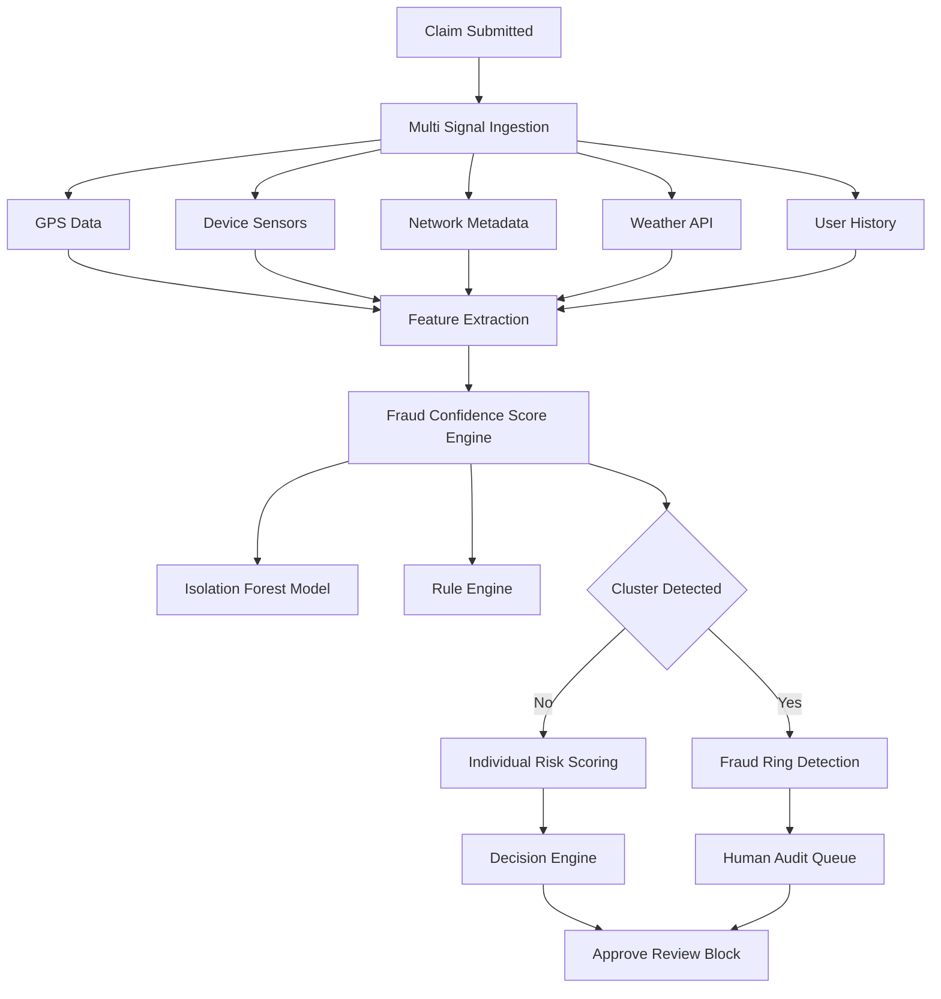
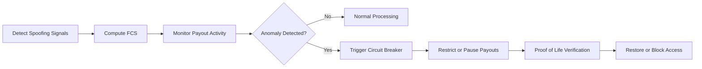

# 🛡️ Adversarial Defense & Anti-Spoofing Strategy  
### 🚀 Guidewire DEVTrails Hackathon – Phase 1  

> 🚨 **The threat is real. Our response is airtight.**  
> We don’t just verify location — **we verify reality.**

---

## ⚡ Core Insight
> **Fraud is not a single anomaly — it is a pattern. We detect patterns, not just points.**

---

## 🧠 Problem Overview

A coordinated syndicate of 500 delivery workers exploited **GPS spoofing** to trigger false payouts from a parametric insurance system.

### 🚨 Key Challenges
- GPS spoofing bypasses traditional verification  
- Fraud rings operate in synchronized clusters  
- Real disasters create noisy, incomplete data  
- False positives can harm genuine workers  

---

## 🔍 Differentiation: Genuine vs Fraud

### ✅ Genuine Worker
- GPS aligns with delivery route  
- Sensor data reflects real-world disruption  
- Weak/unstable network in disaster zones  
- Low historical claim frequency  
- Multi-source verification (cell tower + weather + last ping)

### ❌ Fraud Actor
- Perfect GPS (no jitter/drift)  
- Stable home Wi-Fi in disaster zone  
- No movement / unrealistic stillness  
- IP / SSID mismatch  
- Instant location jumps  

---

## 🛡️ Multi-Layer Detection Architecture

### 1️⃣ Device & Identity Layer
- Device fingerprinting  
- Multi-account detection  
- Emulator / virtualization detection  

### 2️⃣ GPS Integrity Layer
- Speed anomaly detection  
- Route validation  
- Mock location detection  
- GNSS signal anomaly (C/N0, AGC dips, jitter)

### 3️⃣ Behavioral Intelligence Layer
- Claim frequency patterns  
- Incentive abuse detection  
- Time-based anomalies  

### 4️⃣ Fraud Ring Detection ⭐
- Graph-based clustering  
- Shared IP / device correlation  
- Synchronized claim detection  

### 5️⃣ Transaction Monitoring Layer
- Payout spikes  
- Micro-transaction abuse  
- Liquidity drain patterns  

---

## 📊 Multi-Signal Data Intelligence

| Data Source | Extracted Signal | Purpose |
|------------|-----------------|--------|
| Sensors | Motion, pressure | Real-world validation |
| Network | IP, Wi-Fi | Location authenticity |
| GPS | Drift, jitter, HDOP | Spoof detection |
| History | Claim patterns | Behavior modeling |
| Weather API | Severity index | Context validation |
| Delivery Data | Last ping | Ground truth |
| Graph Model | User clusters | Fraud ring detection |

---

## ⚖️ Fraud Confidence Score (FCS)

| Score | Status | Action |
|------|--------|--------|
| 🟢 0–30 | Trusted | Instant payout |
| 🟡 31–60 | Review | Soft verification |
| 🟠 61–80 | Risky | Restrict payouts |
| 🔴 81–100 | Fraud | Block & investigate |

👉 Built using **Isolation Forest + Rule Engine**

---

## 🧩 UX Balance: Protecting Honest Users

### 🟢 Trusted
- Instant payout  
- Zero friction  

### 🟡 Review
- Passive verification (video/selfie)  
- No penalty  
- Delayed approval if network unavailable  

### 🔴 Blocked
- Fraud confirmed  
- Transparent explanation  
- Appeal allowed  

### 📌 Honest Worker Protection
- Missing data ≠ fraud  
- First-time grace threshold  
- No instant bans  

---

## 🧪 Attack Simulation

**Scenario:** 50 users trigger claims simultaneously  

### Detection Flow:
- GPS valid ❌  
- Shared IP detected ⚠️  
- No sensor variation ⚠️  
- Cluster spike detected 🚨  
- FCS drops → Fraud Alert  

### Outcome:
- Cluster payouts frozen  
- Human audit triggered  
- Genuine users preserved  

---

## 🧠 Advanced Spoofing Detection (Deep Tech)

### A. Environment Fingerprints
- Developer mode / mock location flags  
- Virtualization detection  
- Hooking frameworks (Frida, Xposed)

### B. Signal Telemetry
- GNSS vs NTP time mismatch  
- Signal strength anomalies (C/N0)  
- AGC dips (fake signal overpowering)  

### C. Physical Reality Checks
- Movement vs sensor mismatch  
- Perfect straight-line routes detection  

---

## 🚨 Circuit Breaker System (Liquidity Protection)

### Tier 1: Velocity Control
- Detect payout spikes (3σ threshold)  
- Shift to delayed payouts  

### Tier 2: Fraud Cluster Freeze
- Freeze accounts with shared spoofing signatures  
- Mark liquidity pool as high-risk  

### Tier 3: Emergency Lock
- Trigger global payout freeze  
- Require proof-of-life verification  

### 🛡️ Safe Harbor Logic
- High-trust users exempted  
- Region-based isolation  
- Prevents collateral damage  

---

## 🏗️ System Architecture

## ⚙️ Scalability & Performance

### 🚀 Real-Time Processing
- Sub-second fraud scoring (<1s latency)  
- Immediate decisioning for payout workflows  
- Optimized for high-throughput environments  

### 🔁 Batch Intelligence Layer
- Fraud ring detection every **15 minutes**  
- Pattern aggregation across users and regions  
- Continuous model refinement from historical data  

### 🌐 Distributed Architecture
- Horizontally scalable microservices  
- Load-balanced processing pipelines  
- Fault-tolerant system design for high availability  

### 🧩 Modular System Design
- Independent detection layers (plug-and-play)  
- Easy upgrades for new fraud patterns  
- Extensible architecture for future integrations  

---

## 🔐 Privacy & Ethical Design

### 🔒 Data Protection
- End-to-end encryption of sensitive data  
- Anonymized user identifiers for analysis  

### 👁️ Minimal Surveillance Principle
- No continuous background tracking  
- Data collected only during active claims  

### 🧠 Explainable AI
- Transparent decision-making (FCS breakdown)  
- Clear reasoning for flagging or blocking users  

### ⚖️ Ethical Fairness
- No bias against low-connectivity regions  
- Missing data treated as neutral, not suspicious  

---

## 🏆 Why Our Solution Stands Out

### 🛡️ Robust by Design
- Multi-layer architecture → no single point of failure  
- Combines **device, network, behavioral, and graph intelligence**  

### 🧠 Advanced Fraud Detection
- Detects both **individual anomalies** and **coordinated fraud rings**  
- Uses hybrid approach: ML (Isolation Forest) + rule engine  

### ⚡ Intelligent Processing
- Real-time detection + batch-level insights  
- Adaptive system that evolves with new fraud patterns  

### 🤝 User-Centric Approach
- Minimizes false positives  
- Protects genuine users with fairness-first logic  

### 🏗️ Production-Ready
- Scalable, modular, and deployable in real-world systems  
- Designed for high-volume, real-time platforms  

---
## 🔁 Summary of Logic Flow

### 📌 Core Pipeline
- **Identify** → Detect GPS spoofing signals using environment & telemetry data  
- **Monitor** → Track payout velocity and anomaly spikes across flagged accounts  
- **Trigger** → Activate circuit breakers when liquidity risk crosses threshold (e.g., 3σ spike)  
- **Verify** → Require "Proof-of-Life" validation for suspicious accounts before resuming payouts

### 🏗️ Logical Flow Diagram

